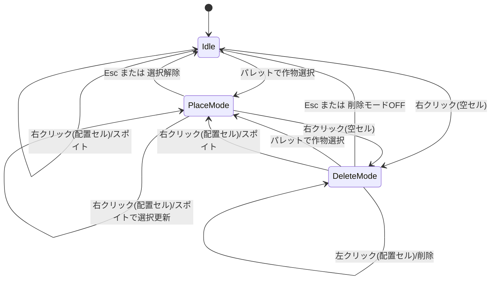

# Ironman Mutation Plan 実装仕様書 v1.0

## 1. 目的
本ツールは以下の2つの役割を持つ。

1. **盤面エディタ**: 10x10 盤面で素材/中間/最終生産物の配置計画を作成する。
2. **需要供給プランナー**: `config.json` の依存関係を逆算し、必要素材・不足・余剰・ボトルネックを可視化する。

---

## 2. スコープ

### 2.0 参照実装とオリジナル範囲
- 配置機能のUXは参照サイト `https://skymutations.eu/greenhouse` の操作感を参考にする
- 本ツールの独自価値はノードエディタ（依存関係の編集・需要供給調整・逆算可視化）に置く
- 画面文言・レイアウト・画像アセットは本プロジェクト独自実装とし、参照サイトの直接複製は行わない
- 配置機能は「左クリック配置」「右クリックスポイト」「空セル右クリックで削除モード」を正式仕様とする

### 2.1 MVPに含める
- `config.json` 読み込みと依存グラフ構築
- 10x10 盤面編集（配置・削除・保存/読込）
- `size=1/2/3` の占有判定（1x1, 2x2, 3x3）
- 目標生産物からの逆算（同一ノード需要合算）
- エッジ編集（固定供給量モードを既定、配分率モードを補助）
- 数量丸め（常に切り上げ）
- 不足/余剰の可視化
- 推定必要ステージ数の算出

### 2.2 MVPに含めない
- 自動最適配置（探索アルゴリズム）
- 複数盤面同時最適化
- 特殊効果の詳細シミュレーション（`specialEffect` の高度挙動）

---

## 3. 入力データ仕様

## 3.1 `config.json` (既存)
- `mutations[]`
  - `id: number`（ユニーク）
  - `name: string`
  - `size: 1 | 2 | 3`
  - `image: string`
  - `maxGrowthStage: number`
  - `conditions?: { id: number; amount: number }[]`
  - `specialEffect?: string`

### 3.2 解釈ルール
- `conditions` が無い作物はベース素材（展開終端候補）
- 素材は回収不可（配置時点で消費済み扱い）
- 依存展開中、同一作物への需要は合算

---

## 4. ドメインモデル（実装用）

```ts
export type MutationId = number;

export interface MutationDef {
  id: MutationId;
  name: string;
  size: 1 | 2 | 3;
  image: string;
  maxGrowthStage: number;
  conditions?: Array<{ id: MutationId; amount: number }>;
  specialEffect?: string;
}

export interface GridCell {
  x: number; // 0..9
  y: number; // 0..9
  occupant?: {
    mutationId: MutationId;
    role: "material" | "intermediate" | "final";
    plannedOutput?: number; // そのセル(またはアンカー)の予定生産数
  };
}

export interface Placement {
  mutationId: MutationId;
  anchorX: number; // 左上アンカー
  anchorY: number;
  size: 1 | 2 | 3;
  role: "material" | "intermediate" | "final";
  plannedOutput: number;
}

export type EdgeMode = "fixed" | "ratio";

export interface EdgePolicy {
  fromId: MutationId; // 親(要求元)
  toId: MutationId;   // 子(供給側)
  mode: EdgeMode;
  fixedSupply?: number; // mode=fixed のとき優先
  ratio?: number;       // mode=ratio のとき比率(0..1)
}

export interface DemandRow {
  mutationId: MutationId;
  required: number;   // 必要量（切り上げ済み）
  supplied: number;   // 計画供給量
  shortage: number;   // max(0, required - supplied)
  surplus: number;    // max(0, supplied - required)
  tier: number;       // 最終目標からの依存段階
}
```

---

## 5. 盤面仕様

### 5.1 グリッド
- 10x10 固定
- 座標は `(x, y)` の 0-index

### 5.2 配置制約
- `size=1` は 1x1
- `size=2` は 2x2
- `size=3` は 3x3
- 盤面外にはみ出す配置は禁止
- 既存占有マスとの重複は禁止

### 5.3 編集操作
- 左クリックで現在選択中の作物を配置
- 右クリックはスポイト機能（クリック対象の作物を選択中にする）
- 右クリック対象が空セルの場合は削除モードに切り替える
- 配置時に `role` と `plannedOutput` を設定
- Undo/Redo はMVPでは任意（将来拡張）

### 5.4 保存形式（例）
```json
{
  "version": 1,
  "placements": [
    {
      "mutationId": 41,
      "anchorX": 2,
      "anchorY": 3,
      "size": 1,
      "role": "final",
      "plannedOutput": 12
    }
  ],
  "edgePolicies": []
}
```

### 5.5 編集モード状態遷移図


#### 補足ルール
- 右クリックは常にスポイト判定を先に行う
- 右クリック対象が配置セルなら、その作物を現在選択に設定し `PlaceMode` に遷移
- 右クリック対象が空セルなら `DeleteMode` に遷移
- `DeleteMode` 中の左クリックは占有セルのみ削除対象（空セルクリックは状態維持）

---

## 6. 逆算エンジン仕様

### 6.1 基本展開
- 入力: 最終目標 `Goal[] = { mutationId, amount }[]`
- 各目標について依存を再帰展開し、必要量を積み上げる
- 子需要は `親需要 * condition.amount` を基準に算出
- 算出後、各段階/各ノードで **常に切り上げ**

### 6.2 合算
- 複数経路から同一 `mutationId` が要求された場合、`required` を合算

### 6.3 エッジ供給ポリシー

#### 既定モード: `fixed`
- エッジに `fixedSupply` を設定
- 親需要に対し固定値をまず割当
- 足りない分は不足として残す
- 余る分は余剰として計上

#### 補助モード: `ratio`
- 同じ親から出る ratio エッジで需要を按分
- `childRequired = ceil(parentRequired * ratio)`
- ratio 合計が 1 を超える場合は警告（計算は継続）

### 6.4 不足/余剰
- `shortage = max(0, required - supplied)`
- `surplus = max(0, supplied - required)`

### 6.5 階層(Tier)
- 最終目標を Tier 0
- 1段依存先を Tier 1 として BFS で付与

### 6.6 循環と異常
- DFSの訪問スタックで循環検知
- 未定義 `id` はエラー行として報告
- `amount <= 0` は不正として警告

---

## 7. 推定必要ステージ数

### 7.1 定義
盤面内で `role in {intermediate, final}` かつ `plannedOutput > 0` の作物集合を対象とする。

- `longest = max(maxGrowthStage)`
- `n = longest` を持つ作物の必要生産数（同値複数時は最大 `plannedOutput` を採用）
- 調和数 `H_n = Σ(1/k), k=1..n`
- 推定必要ステージ数:

`estimateStages = longest + 4 * H_n`

### 7.2 実装上の扱い
- `n <= 0` のとき `estimateStages = longest`
- 表示は小数第2位まで（内部計算は倍精度）

---

## 8. UI仕様（MVP）

### 8.1 レイアウト
- 左: 作物パレット（検索・カテゴリ）
- 中央: 10x10 盤面
- 右上: 依存ノードビュー
- 右下: 需要供給テーブル（required/supplied/shortage/surplus/tier）

### 8.2 連携動作
- ノード選択 → 盤面上の該当配置をハイライト
- 盤面配置選択 → 依存サブツリーを強調
- エッジ編集時に即再計算

### 8.3 エッジ編集UX
- デフォルト入力欄は `fixedSupply`
- 詳細設定で `ratio` に切替可能
- モード切替時は未使用フィールドを無効化（値は保持可）

### 8.4 ノードエディタ操作一覧（MVP）
- ノード選択: 左クリックで選択、選択中ノードの入出力エッジを強調
- ノード移動: ドラッグで位置移動（レイアウト保存対象）
- エッジ作成: ノード出力ハンドルから別ノードへドラッグ
- エッジ選択: クリックでプロパティパネルを開く
- エッジ削除: エッジ選択 + Delete キー
- エッジ編集: `mode`（`fixed` / `ratio`）と `fixedSupply` / `ratio` を編集
- ノード固定: レイアウト固定トグル（自動整列対象外）

### 8.5 ノードエディタ最小ワイヤー
```text
┌─────────────────────────── App ───────────────────────────┐
│ [左] 作物パレット        [中央] 10x10盤面                │
│ ─ 検索                    ─ 配置/削除/スポイト            │
│ ─ 作物一覧                ─ 選択中作物インジケータ         │
│                                                          │
│ [右上] ノードエディタ                                    │
│ ┌──────────────────────────────────────────────────────┐ │
│ │ ノードキャンバス                                      │ │
│ │  [A]──e1──>[B]──e3──>[D]                             │ │
│ │    └─e2──>[C]                                         │ │
│ └──────────────────────────────────────────────────────┘ │
│  選択ノード: B   入力: A(e1)   出力: D(e3)              │
│                                                          │
│ [右下] プロパティ + 需要供給テーブル                    │
│  エッジe1: mode=fixed, fixedSupply=12                  │
│  ─ required / supplied / shortage / surplus / tier      │
└──────────────────────────────────────────────────────────┘
```

### 8.6 ノード編集イベント仕様
- `onNodeSelect(nodeId)`
  - ノード選択状態更新
  - 盤面ハイライト対象を `nodeId` に同期
- `onEdgeCreate(fromId, toId)`
  - 初期値 `mode=fixed`, `fixedSupply=0` で追加
  - 循環検知を実施し、循環時は警告表示（追加可否は設定で制御）
- `onEdgeUpdate(edgeId, patch)`
  - 入力値をバリデーション（`fixedSupply>=0`, `0<=ratio<=1`）
  - 成功時に即再計算
- `onEdgeDelete(edgeId)`
  - エッジ削除後に即再計算
- `onLayoutChange(nodePositions)`
  - ビュー用レイアウトとして保存（計算結果には不影響）

---

## 9. API/モジュール境界

### 9.1 Core API（フロント内でも可）
```ts
loadMutations(configPath): MutationDef[]
validateMutations(mutations): ValidationIssue[]
buildDependencyGraph(mutations): Graph
planDemands(goals, edgePolicies, graph): DemandPlanResult
estimateStages(placements, mutations): number
```

### 9.2 推奨ディレクトリ
- `src/domain/` データ型・純関数
- `src/planner/` 逆算エンジン
- `src/grid/` 盤面ロジック
- `src/ui/` コンポーネント
- `src/state/` 状態管理

---

## 10. 受け入れ基準

1. 最終目標を入力すると、必要素材ツリーと総量が再現可能
2. 同一素材の多経路需要が合算される
3. 固定供給量モードで不足/余剰が正しく表示される
4. 配分率モードで切り上げ計算が適用される
5. 2x2/3x3 配置衝突が防止される
6. 推定必要ステージ数が式通りに表示される
7. 循環・未定義IDでクラッシュせず警告表示される

---

## 11. 実装順序（推奨）

1. `config.json` バリデーション + グラフ生成
2. 逆算計算コア（固定供給優先）
3. 10x10 盤面配置ロジック（衝突判定）
4. UI最小構成（盤面/ノード/テーブル）
5. エッジ編集UI（fixed既定、ratio補助）
6. ステージ推定と警告表示
7. 保存/読込と最終調整

---

## 12. 今後の拡張候補
- specialEffect ごとの補正ロジック
- 生産サイクル時間の詳細モデル
- 複数盤面・複数レシピの同時最適化
- 自動提案（不足最小化配置案）
